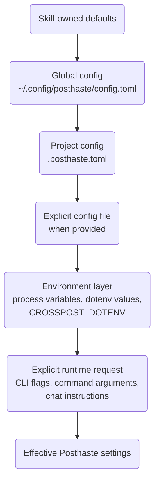

# AI-assisted social publishing, posthaste


Posthaste is a collection of reusable AI skills for drafting, adapting, reviewing, and publishing social media content. Let's keep social publishing workflows focused, portable, and easy to use across projects and AI assistants.

* [AI-assisted social publishing, posthaste](#ai-assisted-social-publishing-posthaste)
* [Install](#install)
* [Update](#update)
* [Configuration](#configuration)
* [Networks](#networks)
  * [Crosspost networks](#crosspost-networks)
  * [X/Twitter manual posting](#xtwitter-manual-posting)
  * [Token-authenticated networks](#token-authenticated-networks)
* [Skills](#skills)
* [The cabinet of @davidsneighbour's skills](#the-cabinet-of-davidsneighbours-skills)

## Install

Install the current Posthaste skill set with:

```bash
npx skills add https://github.com/davidsneighbour/skillwerk/tree/main/collections/posthaste/skills --yes
```

Install the full skill set together. The skills are intentionally
interconnected: posting, configuration, voice checks, hashtag retrieval, and
network token helpers depend on each other for the complete workflow.

## Update

Re-run the install command to refresh an existing install:

```bash
npx skills add https://github.com/davidsneighbour/skillwerk/tree/main/collections/posthaste/skills --yes
```

Use `--global` when the skills should be available outside the current project.

## Configuration

Posthaste can use layered TOML configuration for persistent, non-secret defaults:

| path | notes |
| --- | --- |
| ~/.config/posthaste/config.toml | global user configuration |
| .posthaste.toml | project configuration |

Configuration is applied over defaults owned by each skill. Project settings override global settings, explicitly supplied config files override project settings, environment-specific overrides such as `CROSSPOST_DOTENV` override those files where applicable, and explicit command, argument, or user-request values from the chat override configuration.



Example:

```toml
version = 1

[posting]
default_networks = [
  "mastodon",
  "bluesky",
  "linkedin",
]

[paths]
dotenv = "~/.env"
posted_log = "~/.local/share/posthaste-prepare-link/posted.jsonl"

[networks.reddit]
enabled = true

[networks.reddit.env]
access_token = "REDDIT_ACCESS_TOKEN"
client_id = "REDDIT_CLIENT_ID"
client_secret = "REDDIT_CLIENT_SECRET"
refresh_token = "REDDIT_REFRESH_TOKEN"
```

Use `posthaste-config` to inspect, validate, initialise, or edit these files. The setup workflow can ask for values such as default posting networks, custom paths, and environment-variable name overrides.

Do not store passwords, access tokens, refresh tokens, client secrets, private keys, or other credentials in the TOML files. Configuration may contain the names of environment variables that hold those values; credentials themselves remain in environment-backed secret storage such as the configured `~/.env` file.

## Networks

Posthaste separates networks by how much setup and automation they can safely support. Configure the easy Crosspost-backed networks first, keep X/Twitter manual, then add the direct API networks that need a token helper flow.

### Crosspost networks

`posthaste-prepare-link` can publish confirmed posts through [`@humanwhocodes/crosspost`](https://github.com/humanwhocodes/crosspost) for these networks:

* Mastodon: set `MASTODON_ACCESS_TOKEN` and `MASTODON_HOST`.
* Bluesky: set `BLUESKY_HOST`, `BLUESKY_IDENTIFIER`, and `BLUESKY_PASSWORD`.
* LinkedIn: set `LINKEDIN_ACCESS_TOKEN`.
* Nostr: set `NOSTR_PRIVATE_KEY` and `NOSTR_RELAYS`.

These are the easiest networks to enable because they use the shared Crosspost transport. Store their values in the configured dotenv file, usually `~/.env`, and use `posting.default_networks` to decide which of them run by default.

### X/Twitter manual posting

X/Twitter is intentionally not part of automated posting. When the user asks to post to Twitter or X, use the prepared text and screenshot from `posthaste-prepare-link`, then run the manual intent helper:

```bash
node skills/posthaste-prepare-link/resources/post-twitter-intent.ts \
  --message-file ./message.txt \
  --url https://example.com/post \
  --open
```

Review the opened X/Twitter compose window, attach the screenshot manually if needed, and click the final post button only after explicit confirmation. Log the result in the posted-log workflow so future runs know the link has already been handled for Twitter/X.

### Token-authenticated networks

Reddit, Threads, and Tumblr use direct API integrations instead of Crosspost. Each one has a companion refresh-token skill with a small callback server or hosted callback page so OAuth tokens can be generated without printing secrets in chat.

* Reddit uses `posthaste-reddit-refresh-token` to create a refresh token through a local loopback server. Posting needs either `REDDIT_ACCESS_TOKEN`, `REDDIT_USER_AGENT`, and `REDDIT_SUBREDDIT`, or `REDDIT_CLIENT_ID`, `REDDIT_CLIENT_SECRET`, `REDDIT_REFRESH_TOKEN`, `REDDIT_USER_AGENT`, and `REDDIT_SUBREDDIT`.
* Threads uses `posthaste-threads-refresh-token` to create or refresh a long-lived access token. Posting needs `THREADS_ACCESS_TOKEN` and `THREADS_USER_ID`; app setup also uses `THREADS_APP_ID` and `THREADS_APP_SECRET`.
* Tumblr uses `posthaste-tumblr-refresh-token` to create or refresh OAuth2 credentials. Posting needs `TUMBLR_ACCESS_TOKEN` and `TUMBLR_BLOG_IDENTIFIER`; app setup also uses `TUMBLR_CONSUMER_KEY`, `TUMBLR_CONSUMER_SECRET`, and often `TUMBLR_REFRESH_TOKEN`.

After setting up any of these networks, verify what Posthaste can see:

```bash
node skills/posthaste-prepare-link/resources/post-crosspost.ts --info
```

## Skills

* `posthaste` routes the social publishing skill set.
* `posthaste-config` loads, validates, merges, and creates layered TOML configuration.
* `posthaste-prepare-link` drafts and publishes confirmed social posts from URLs.
* `posthaste-post-retrieve-hashtags` generates topical hashtags from a URL or supplied text.
* `posthaste-unsplash` searches, previews, selects, and tracks Unsplash photos with required attribution.
* `posthaste-voice` edits, rewrites, and reviews prose so it keeps the author's voice.
* `posthaste-reddit-refresh-token` creates Reddit OAuth credentials for direct Reddit posting.
* `posthaste-threads-refresh-token` creates or refreshes Threads API credentials.
* `posthaste-tumblr-refresh-token` creates or refreshes Tumblr OAuth2 credentials.

## The cabinet of @davidsneighbour's skills

| Exhibit | Skill |
| :---: | :--- |
| [](https://github.com/davidsneighbour/clerkwork) | **[Clerkwork](https://github.com/davidsneighbour/clerkwork):** It's an engineers world. Start your engines, maintain, contrive, and put in the works. |
| [](https://github.com/davidsneighbour/gallimaufry) | **[Gallimaufry](https://github.com/davidsneighbour/gallimaufry):** A miscellaneous collection of small AI skills and odd useful workflows. |
| [](https://github.com/davidsneighbour/gazetteer) | **[Gazetteer](https://github.com/davidsneighbour/gazetteer):** Place-aware patterns for geographic content, local context, and location-rich publishing. |
| [](https://github.com/davidsneighbour/idiolect) | **[Idiolect](https://github.com/davidsneighbour/idiolect):** Finding your own language in skill outputs. |
| [](https://github.com/davidsneighbour/patternbook) | **[Patternbook](https://github.com/davidsneighbour/patternbook):** Patterns for better digital work. |
| [](https://github.com/davidsneighbour/posthaste) | **[Posthaste](https://github.com/davidsneighbour/posthaste):** A collection of skills to post to social media of all kinds. |
